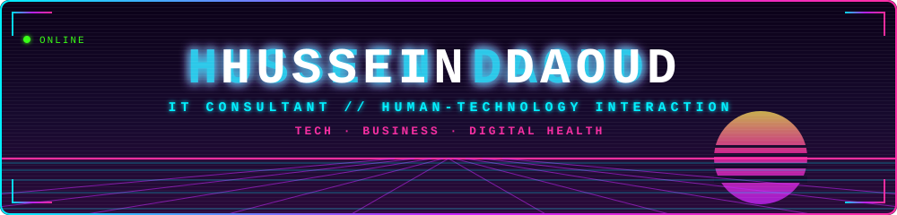

<!-- github.com/hussein-da — Repo muss exakt "hussein-da/hussein-da" heißen.
     assets/header.svg muss im selben Repo liegen. -->

  

  
  
  
  

## ▸ BUILDS

<!-- TODO: Beschreibungen anpassen — ich habe sie geraten. -->

| | |
|---|---|
| **[docu-smart-answer](https://github.com/hussein-da/docu-smart-answer)** · `TypeScript` | Ask your own documents a question — get an answer with sources |
| **[note-ai-assistant](https://github.com/hussein-da/note-ai-assistant)** · `TypeScript` | Raw notes in, structured searchable knowledge out |
| **[offline-transcriber](https://github.com/hussein-da/offline-transcriber)** · `Python` | Speech-to-text, fully local — no audio ever leaves the machine |
| **[smart-home-butler-voice](https://github.com/hussein-da/smart-home-butler-voice)** · `TypeScript` | Voice-controlled smart home with natural language intents |

## ▸ CONTRIBUTION SNAKE

  

  

